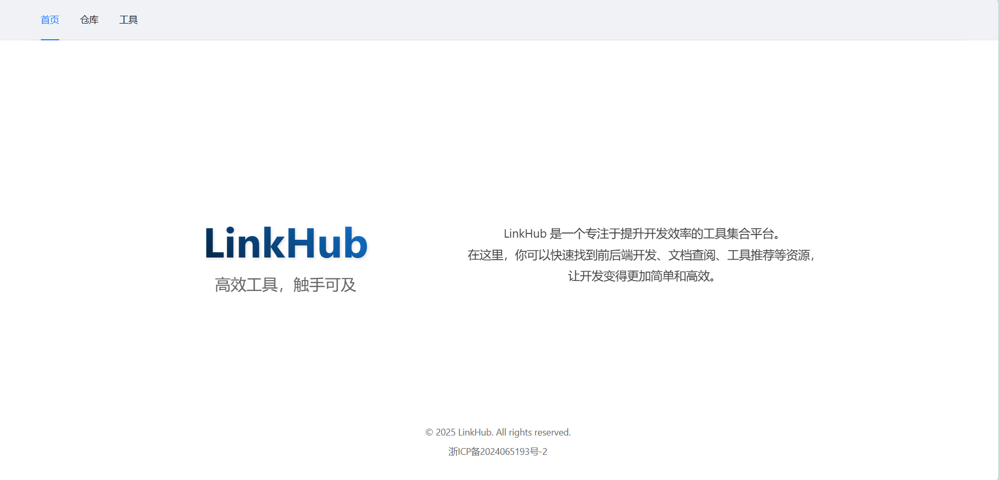

# LinkHub

LinkHub 是一个专注于提升开发效率的工具集合平台。在这里，你可以快速找到前后端开发、文档查阅、工具推荐等资源，让开发变得更加简单和高效。无论是生成短链接、管理项目资源，还是探索开发工具，LinkHub 都致力于为开发者提供一站式的解决方案，帮助你在开发过程中节省时间、提高效率。

---

## 项目演示




---

## 项目结构

### 前端 (`linkhub-frontend`)
- **技术栈**：Vue 3 + TypeScript + Vite + Ant Design Vue
- **主要功能**：
  
  - 生成短链接
  - 管理链接
  - 工具页面
- **目录结构**：
  ```
  linkhub-frontend/
  ├── src/
  │   ├── assets/            # 静态资源
  │   ├── components/        # 组件
  │   ├── views/             # 页面视图
  │   ├── router/            # 路由配置
  │   ├── main.ts            # 入口文件
  │   └── App.vue            # 根组件
  ├── vite.config.ts         # Vite 配置
  └── env.d.ts               # 环境类型声明
  ```

### 后端 (`linkhub-backend`)
- **技术栈**：Spring Boot + MySQL + MyBatisPlus + PaginationInnerInterceptor
- **主要功能**：
  
  - 提供短链接生成 API
  - 管理链接数据
- **目录结构**：
  
  ```
    linkhub-backend/
    ├── src/
    │   ├── main/
    │   │   ├── java/
    │   │   │   └── top/
    │   │   │       └── zfmx/
    │   │   │           └── linkhub/
    │   │   │               ├── application/      # 应用层
    │   │   │               ├── domain/           # 领域层
    │   │   │               ├── infrastructure/   # 基础设施层
    │   │   │               └── interfaces/       # 接口层
    │   │   └── resources/   # 配置文件
    └── pom.xml              # Maven 配置文件
  ```

---

## 快速开始

### 前端运行
1. 进入 `linkhub-frontend` 目录：
   ```bash
   cd linkhub-frontend
   ```

2. 安装依赖：
   ```bash
   npm install
   ```

3. 启动开发服务器：
   ```bash
   npm run dev
   ```

4. 访问 `http://localhost:5174`。

5. 配置 `src` 下的 config.ts 短链接地址以及后端地址
---

### 后端运行
1. 确保已安装 JDK 17 和 Maven。

2. 进入 `linkhub-backend` 目录：
   ```bash
   cd linkhub-backend
   ```

3. 编译项目：
   ```bash
   mvn clean install
   ```

4. 数据库：运行 `linkhub.sql` 文件。

5. 数据库配置：
   ```yaml
   spring:
     datasource:
       url: jdbc:mysql://localhost:3306/linkhub
       username: your_username
       password: your_password
       driver-class-name: com.mysql.cj.jdbc.Driver
   ```

6. 启动应用：
   ```bash
   mvn spring-boot:run
   ```

7. 后端服务将运行在 `http://localhost:8080`。

---

## 功能说明

### 前端功能
- **首页**：展示欢迎页面。
- **LinkHub**：常用的网站链接。
- **工具**：
  - 短链接生成
  - 二维码生成
  - IP/域名查询
- **设置**：用户设置页面。

### 后端功能
- **短链接生成**：通过 `/api/link/generate` 接口生成短链接。
- **链接管理**：提供链接的增删改查功能。

---

## 技术细节

### 前端
- **路由配置**：使用 `vue-router` 管理页面路由。
- **请求代理**：通过 Vite 配置代理，解决跨域问题。
- **UI 框架**：使用 Ant Design Vue 构建界面。
- **动态组件加载**：使用 `markRaw` 避免组件响应式化。

### 后端
- **API 设计**：RESTful 风格 API。
- **数据库**：使用 MySQL 存储链接数据。
- **数据访问**：通过 MyBatis 实现数据访问。

---

## 贡献指南
1. Fork 项目仓库。
2. 创建新分支：`git checkout -b feature/your-feature`。
3. 提交更改：`git commit -m 'Add some feature'`。
4. 推送分支：`git push origin feature/your-feature`。
5. 提交 Pull Request。

---

## 许可证
本项目采用 MIT 许可证。详情请参阅 [LICENSE](LICENSE) 文件。
